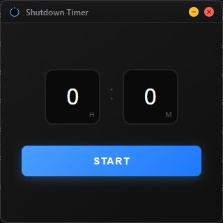
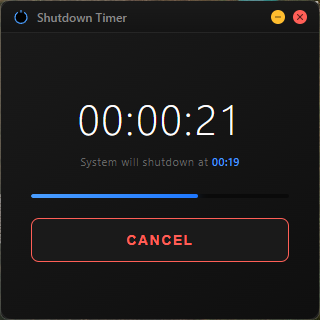

# 🔌 PC Shutdown Timer

Modern, minimalist shutdown timer application for Windows with a sleek dark interface.

  

## 📥 Download

<div align="center">
  <a href="https://github.com/tugayigus/pcshutdowntimer/releases/download/v1.0.0/ShutdownTimer.exe">
    
  </a>
</div>

## 📸 Screenshots

<div align="center">
  
  
</div>

## ✨ Features

- **⏰ Flexible Timer** - Set hours and minutes, or just enter minutes (auto-converts to H:M)
- **🌙 Dark Theme** - Modern dark UI that's easy on the eyes
- **⚡ Instant Shutdown** - Silent shutdown without Windows notifications
- **⌨️ Keyboard Shortcuts** - ESC or Enter to cancel timer
- **🎯 Minimalist Design** - Clean 320x320px square window
- **📦 Portable** - No installation required, just run the .exe

## 🚀 Quick Start

1. **Download** the latest release
2. **Run** `ShutdownTimer.exe`
3. **Set** your timer and click START

## 🎮 How to Use

### Setting Timer
- Enter hours and/or minutes
- Enter only minutes (e.g., 90 = 1h 30m)
- Click **START** or press Enter

### During Countdown
- View remaining time and shutdown time
- Press **ESC** or **Enter** to cancel
- Click **CANCEL** button to stop

### Window Controls
- **Minimize** - Minimize to taskbar
- **Close** - Exit application completely

## 💻 System Requirements

- **OS**: Windows 7 or newer
- **RAM**: 50MB
- **Storage**: 100MB
- **Dependencies**: None (fully portable)

## 🛠️ Development

Built with:
- **Electron** - Cross-platform desktop framework
- **HTML/CSS/JS** - Modern web technologies
- **Node.js** - JavaScript runtime

### Build from Source

```bash
# Clone repository
git clone https://github.com/tugayigus/pcshutdowntimer.git
cd pcshutdowntimer

# Install dependencies
npm install

# Run in development
npm start

# Build executable
npm run build
```

## 📝 License

This project is licensed under the MIT License.

## 🤝 Contributing

Feel free to fork, modify, and submit pull requests. All contributions welcome!

---

**Made with ❤️ for Windows users who need a simple, reliable shutdown timer.**
